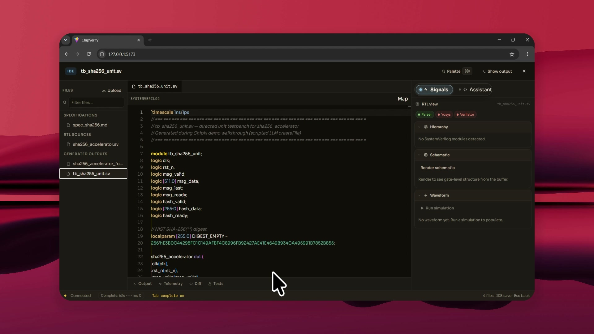

<p align="center">
  
</p>

<p align="center">
  <a href="LICENSE"></a>
  
  
</p>

<h1 align="center">Chipix Studio</h1>

<p align="center"><strong>Spec to proven — on open tools, with evidence you can audit.</strong></p>

<p align="center">
  You finished the RTL. Now you need proof it matches the spec — before tape-out.<br />
  Chipix is an open-source, AI-native studio that builds a mental model of your design,<br />
  proposes a verification plan you approve, runs UnitSim / Formal / UVM on open simulators,<br />
  and writes results back as evidence tied to requirements — on your machine, with models you choose.
</p>

<p align="center">
  <a href="https://chipix.in/">Website</a> ·
  <a href="https://chipix.in/?demo=1">Try interactive demo</a> ·
  <a href="#see-it">Watch the walkthrough</a> ·
  <a href="#quick-start">Quick start</a>
</p>

## See it

One thread. Spec + RTL in. Named failure. One-click fix. Green.

<p align="center">
  <a href="docs/media/chipix_sha256_walkthrough.mp4">
    
  </a>
</p>

<p align="center">
  <a href="docs/media/chipix_sha256_walkthrough.mp4"><strong>▶ Watch the SHA-256 walkthrough</strong></a>
  &nbsp;(~3.5 min)&nbsp;·&nbsp; fail → Apply → coverage
</p>

**What you just watched (Understand → Plan → Prove)**

1. **Understand** — Chipix reads the spec and RTL, builds a mental model, and waits for your approval.
2. **Plan** — Staged verification recommends UnitSim (and more). You approve the plan before anything runs.
3. **Prove** — A real case fails (`msg_last` on multi-block padding). Chipix names the bug, you Apply the patch, re-run — green, with coverage moving up.

## Why we exist

If you want to build software today, your tools are free. Compilers, editors, kernels, version control — the stack is open, and nobody questions it.

If you want to verify a chip, the story is different. Design and verification tooling often sits behind licenses that cost tens of thousands of dollars per seat, every year. A student can't afford a full environment. A two-person startup burns runway before tape-out. Even large companies ration seats.

We think that's backwards. Every engineer, at every company, at every stage, should be able to sit down and verify a design.

That's why Chipix is open source — and stays open source. Inspect it. Modify it. Self-host it. Build a business on it. No seat counting. No black box between you and your own results.

And because verification is slow, repetitive, and expert-heavy, we put an AI agent in the loop — one you control, including models that never leave your machine.

## How it works

| | |
|---|---|
| **Understand** | Ingest specs and RTL. Build a source-grounded **mental model** that persists as shared memory for every later step. |
| **Plan** | Recommend a strategy. Generate reviewable plans for **UnitSim**, **formal (SVA)**, and **UVM**. Humans approve before execute. |
| **Prove** | Run through open adapters — Verilator, Icarus, Yosys/SymbiYosys, Slang — with compile gates. Store coverage and outcomes as **evidence** tied to requirements. |

The workspace is **thread-first**: conversation, files, plans, diffs, and run cards live side by side — with an IDE rail for live writes and an agent that streams every tool call.

## What ships today

- Spec + RTL ingest → mental model with readiness checks
- Staged verification with human-approved plans
- UnitSim / Formal / UVM generation paths on open EDA tools
- Diff / patch apply in-thread, then re-run
- Desktop app (Windows & Linux) + FastAPI backend + `agent_core` event runtime
- Bring your own LLM: cloud providers, OpenAI-compatible endpoints, or local GGUF via llama.cpp
- VS Code extension for TruthCore-backed verification in the editor

## Who it's for

**Startup** — Stand up real verification without an enterprise contract. Seed money goes to engineers, not seats.

**Student / researcher** — Professional flows on a laptop. Local models if you have no API budget. Learn by reading what the agent generates and why.

**Established team** — Automate the repetitive path while keeping engineers in approval loops. Self-host, audit, extend — GPL keeps the code yours to inspect.

## Quick start

```powershell
git clone https://github.com/Chipix-Company/chipix.git
cd chipix
python -m venv .venv
.\.venv\Scripts\Activate.ps1
pip install -r backend\requirements.txt
npm install && cd frontend && npm install && cd ..
.\launch_all.ps1
```

Full setup — LLM providers, testing, packaging, releases — is in [DEVELOPMENT.md](DEVELOPMENT.md).

## Repository layout

| Path | Purpose |
|---|---|
| `frontend/` | React + Vite desktop workspace UI |
| `backend/` | FastAPI server, project APIs, staged verification |
| `backend/agent_core/` | Event-driven agent runtime |
| `backend/services/mental_model/` | Mental-model builder and readiness |
| `backend/services/verification/` | Strategy, UnitSim / Formal / UVM planning |
| `docs/media/` | README banner + product walkthrough video |
| `electron/` | Electron shell |
| `vscode-extension/` | VS Code extension |
| `Documentation/` | User-facing guides |

## Community

- [Contributing](CONTRIBUTING.md) — setup, tests, PRs
- [Development](DEVELOPMENT.md) — configuration, packaging, releases
- [Security](SECURITY.md) — private vulnerability reports
- [Agent architecture](AGENTS.md) — how the agent runtime works

## License

Copyright © 2026 Chipix Company.

Licensed under the [GNU General Public License v3.0](LICENSE) (`GPL-3.0-or-later`).
