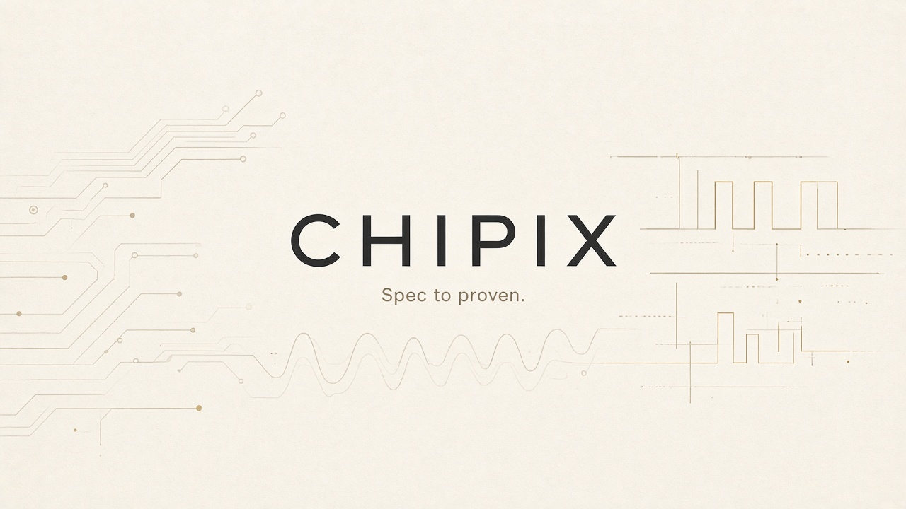

<p align="center">
  
</p>

<p align="center">
  <a href="LICENSE"></a>
  
  
</p>

<h1 align="center">Chipix Studio</h1>

<p align="center"><strong>Spec to proven.</strong></p>

<p align="center">
  You finished the RTL. Now you need proof it matches the spec — before tape-out, not after a week of debug in the lab.
</p>

<p align="center">
  Chipix is open-source software for chip design and verification. Drop in a spec and your SystemVerilog.
  It builds a mental model, proposes a plan, and waits for you to approve it. Then it runs UnitSim, formal, or UVM
  on tools like Verilator and SymbiYosys, and keeps the results tied to the requirements those checks came from.
  Your machine. Your models — cloud keys or a local GGUF. Nothing leaves unless you say so.
</p>

<p align="center">
  <a href="https://chipix.in/">Website</a> ·
  <a href="https://chipix.in/?demo=1">Try interactive demo</a> ·
  <a href="#see-it">Watch the walkthrough</a> ·
  <a href="#quick-start">Quick start</a>
</p>

## See it

The SHA-256 walkthrough is the real app: upload, plan, fail, patch, green.

<p align="center">
  <a href="https://youtu.be/2GP04dO-P_8">
    
  </a>
</p>

<p align="center">
  <a href="https://youtu.be/2GP04dO-P_8"><strong>▶ Watch on YouTube (~3.5 min)</strong></a>
</p>

What happens on screen:

1. Chipix reads the spec and RTL, shows a mental model, and asks you to confirm it.
2. You switch to Verify, pick UnitSim, and hit Implement on the plan card.
3. Two tests pass. The multi-block padding case fails — `msg_last` never fired. Chipix shows a diff; you click Apply; you run again. Green. Coverage moves.

## Why we exist

Software people get free compilers and editors. Chip teams mostly don't. Verification seats can run tens of thousands of dollars a year. Students get locked out. Small teams burn cash on licenses before they burn it on silicon. Big companies ration who even gets a seat.

That feels wrong to us. So Chipix is GPL, and it stays that way. Fork it. Self-host it. Read every line. Sell a business on top of it if you want — just keep the license terms.

Verification work is also slow and full of repetition. We put an agent in the loop for that part. You still approve the plan and the patches. The agent doesn't ship silicon for you.

## How it works

**Mental model.** Spec + RTL go in. Chipix writes down what it thinks the design does (modules, ports, params). You can open that rail and push back before anything runs.

**Staged plan.** It suggests UnitSim, formal (SVA), or UVM. You see the plan as a card. Nothing executes until you click Implement.

**Run + evidence.** Adapters talk to Verilator, Icarus, Yosys/SymbiYosys, Slang. Compile gates catch junk before you trust a pass. Results and coverage hang off the requirements they came from.

The UI is a thread — chat, files, diffs, and run cards in one place — plus an IDE rail when the agent is writing `.sv`.

## What you can do today

- Upload a spec (PDF, DOCX, markdown, images) and an RTL tree
- Approve a mental model, then a staged verification plan
- Generate and run UnitSim / formal / UVM paths on the open tools above
- Apply a patch from a Diff card and re-run without leaving the thread
- Run the desktop app on Windows or Linux; bring Gemini, OpenAI, Azure, NIM, any OpenAI-compatible endpoint, or llama.cpp locally
- Use the VS Code extension if you want TruthCore checks in the editor

Some of this is still rough. Formal generation and regression smarts are the next things we're hardening — not sold as done.

## Who this is for

You're a startup that can't sign a six-figure EDA deal yet, but still needs directed tests and a paper trail.

You're a student or researcher who wants to see what a real UnitSim bench looks like, on a laptop, maybe with no API budget.

You're on a bigger team and you're tired of copy-pasting the same TB scaffolding. Keep engineers in the approval loop; let the agent do the boring drafts. Self-host if your security folks care (they should).

## Quick start

```powershell
git clone https://github.com/Chipix-Company/chipix.git
cd chipix
python -m venv .venv
.\.venv\Scripts\Activate.ps1
pip install -r backend\requirements.txt
npm install && cd frontend && npm install && cd ..
.\launch_all.ps1
```

LLM setup, packaging, and troubleshooting live in [DEVELOPMENT.md](DEVELOPMENT.md).

## Repository layout

| Path | Purpose |
|---|---|
| `frontend/` | React + Vite workspace UI |
| `backend/` | FastAPI, projects, staged verification |
| `backend/agent_core/` | Agent event loop |
| `backend/services/mental_model/` | Mental-model builder |
| `backend/services/verification/` | Strategy and UnitSim / Formal / UVM planning |
| `docs/media/` | README banner, poster, brand mark |
| `electron/` | Desktop shell |
| `vscode-extension/` | VS Code extension |
| `Documentation/` | Longer guides |

## Community

- [Contributing](CONTRIBUTING.md)
- [Development](DEVELOPMENT.md)
- [Security](SECURITY.md)
- [Agent architecture](AGENTS.md)

## License

Copyright © 2026 Chipix Company.

[GNU General Public License v3.0](LICENSE) (`GPL-3.0-or-later`).
